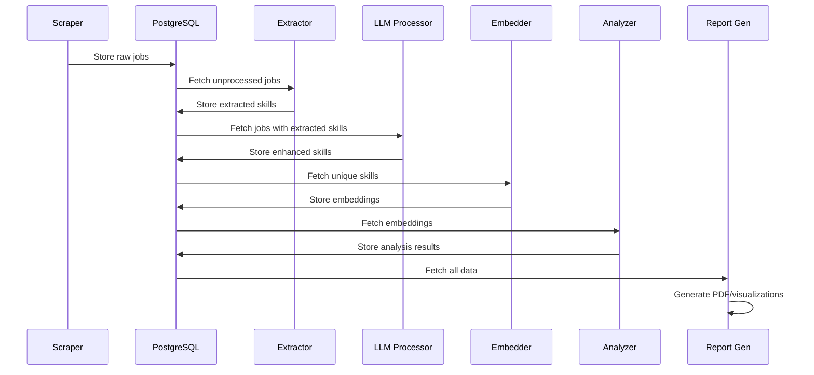

# Data Flow and Sample JSONs Reference
## Complete Inter-Module Communication Patterns

---

## Table of Contents
1. [Pipeline Data Flow Overview](#1-pipeline-data-flow-overview)
2. [Module 1: Scraper Output Samples](#2-module-1-scraper-output-samples)
3. [Module 2: Extractor Output Samples](#3-module-2-extractor-output-samples)
4. [Module 3: LLM Processor Output Samples](#4-module-3-llm-processor-output-samples)
5. [Module 4: Embedder Output Samples](#5-module-4-embedder-output-samples)
6. [Module 5: Analyzer Output Samples](#6-module-5-analyzer-output-samples)
7. [Database State Examples](#7-database-state-examples)
8. [API Communication Patterns](#8-api-communication-patterns)
9. [Error Handling Examples](#9-error-handling-examples)

---

## 1. Pipeline Data Flow Overview



---

## 2. Module 1: Scraper Output Samples

### 2.1 Computrabajo Scraper Output

```json
{
  "job_id": "550e8400-e29b-41d4-a716-446655440000",
  "portal": "computrabajo",
  "country": "CO",
  "url": "https://www.computrabajo.com.co/ofertas-de-trabajo/oferta-de-trabajo-de-desarrollador-full-stack-senior-en-bogota-4B5C6D7E8F",
  "title": "Desarrollador Full Stack Senior",
  "company": "TechCorp Colombia SAS",
  "location": "Bogotá, Cundinamarca",
  "description": "Importante empresa del sector tecnológico busca Desarrollador Full Stack Senior con experiencia en React, Node.js y AWS. Serás responsable de liderar el desarrollo de aplicaciones web escalables, implementar arquitecturas cloud y mentorear al equipo junior. Trabajarás en proyectos innovadores con metodologías ágiles.",
  "requirements": "Requisitos:\n- Mínimo 5 años de experiencia en desarrollo web\n- Dominio de React.js y su ecosistema (Redux, Hooks)\n- Experiencia con Node.js y Express\n- Conocimientos sólidos en AWS (EC2, S3, Lambda)\n- Manejo de bases de datos SQL y NoSQL\n- Git y metodologías ágiles\n- Inglés intermedio",
  "salary_raw": "$6.000.000 - $8.000.000 COP",
  "contract_type": "Tiempo completo",
  "remote_type": "Híbrido",
  "posted_date": "2025-01-15",
  "scraped_at": "2025-01-20T10:30:45.123456Z",
  "content_hash": "a8f5f167f44ace41e489e2f95a87c3e5d",
  "raw_html": "<div class=\"job-posting\">...</div>",
  "is_processed": false
}
```

### 2.2 Bumeran Scraper Output

```json
{
  "job_id": "660e8400-e29b-41d4-a716-446655440001",
  "portal": "bumeran",
  "country": "MX",
  "url": "https://www.bumeran.com.mx/empleos/desarrollador-backend-python-django-1234567.html",
  "title": "Desarrollador Backend Python/Django",
  "company": "Fintech Innovations México",
  "location": "Ciudad de México, CDMX",
  "description": "Fintech líder busca Desarrollador Backend especializado en Python y Django para construir APIs robustas y escalables. Trabajarás con microservicios, implementarás integraciones con sistemas bancarios y optimizarás el rendimiento de nuestras aplicaciones financieras.",
  "requirements": "Experiencia requerida:\n• 3+ años con Python y Django REST Framework\n• Diseño e implementación de APIs RESTful\n• PostgreSQL y Redis\n• Docker y Kubernetes básico\n• Conocimientos en seguridad y criptografía\n• Deseable: Celery, RabbitMQ",
  "salary_raw": "$40,000 - $60,000 MXN mensuales",
  "contract_type": "Tiempo completo",
  "remote_type": "Remoto",
  "posted_date": "2025-01-18",
  "scraped_at": "2025-01-20T11:15:22.654321Z",
  "content_hash": "b7e4g268f55bdf52f590f3g96b98d4f6e",
  "raw_html": "<article class=\"job-card\">...</article>",
  "is_processed": false
}
```

### 2.3 Batch Scraping Summary

```json
{
  "scraping_session_id": "session_20250120_101500",
  "portal": "computrabajo",
  "country": "CO",
  "start_time": "2025-01-20T10:15:00Z",
  "end_time": "2025-01-20T10:45:00Z",
  "statistics": {
    "total_pages_visited": 50,
    "total_jobs_found": 487,
    "successfully_scraped": 475,
    "duplicates_skipped": 12,
    "errors": 0,
    "average_time_per_page": 3.6,
    "jobs_per_minute": 15.8
  },
  "categories_covered": [
    "desarrollo-software",
    "programacion",
    "sistemas",
    "tecnologia"
  ]
}
```

---

## 3. Module 2: Extractor Output Samples

### 3.1 NER Extraction Results

```json
{
  "extraction_id": "770e8400-e29b-41d4-a716-446655440002",
  "job_id": "550e8400-e29b-41d4-a716-446655440000",
  "extraction_timestamp": "2025-01-20T12:00:00Z",
  "extracted_skills": [
    {
      "skill_text": "react",
      "skill_type": "explicit",
      "extraction_method": "ner",
      "entity_label": "FRAMEWORK",
      "confidence_score": 0.95,
      "source_section": "requirements",
      "span_start": 156,
      "span_end": 161,
      "context": "...Dominio de React.js y su ecosistema...",
      "esco_uri": "http://data.europa.eu/esco/skill/react-framework"
    },
    {
      "skill_text": "node.js",
      "skill_type": "explicit",
      "extraction_method": "ner",
      "entity_label": "FRAMEWORK",
      "confidence_score": 0.93,
      "source_section": "requirements",
      "span_start": 234,
      "span_end": 241,
      "context": "...Experiencia con Node.js y Express...",
      "esco_uri": "http://data.europa.eu/esco/skill/nodejs-runtime"
    },
    {
      "skill_text": "aws",
      "skill_type": "explicit",
      "extraction_method": "ner",
      "entity_label": "PLATFORM",
      "confidence_score": 0.97,
      "source_section": "requirements",
      "span_start": 298,
      "span_end": 301,
      "context": "...Conocimientos sólidos en AWS (EC2, S3, Lambda)...",
      "esco_uri": "http://data.europa.eu/esco/skill/amazon-web-services"
    }
  ],
  "extraction_metrics": {
    "total_skills_found": 15,
    "ner_extractions": 8,
    "regex_extractions": 7,
    "esco_matches": 12,
    "processing_time_ms": 245
  }
}
```

### 3.2 Regex Extraction Results

```json
{
  "extraction_id": "880e8400-e29b-41d4-a716-446655440003",
  "job_id": "660e8400-e29b-41d4-a716-446655440001",
  "extraction_timestamp": "2025-01-20T12:05:00Z",
  "regex_patterns_matched": [
    {
      "pattern_name": "experiencia_en",
      "matched_text": "3+ años con Python y Django",
      "extracted_skills": [
        {
          "skill_text": "python",
          "confidence_score": 0.85,
          "years_required": 3,
          "span_location": [45, 51]
        },
        {
          "skill_text": "django",
          "confidence_score": 0.85,
          "span_location": [54, 60]
        }
      ]
    },
    {
      "pattern_name": "conocimientos_de",
      "matched_text": "Conocimientos en seguridad y criptografía",
      "extracted_skills": [
        {
          "skill_text": "seguridad",
          "confidence_score": 0.75,
          "span_location": [178, 187]
        },
        {
          "skill_text": "criptografía",
          "confidence_score": 0.75,
          "span_location": [190, 202]
        }
      ]
    }
  ]
}
```

### 3.3 Combined Extraction Summary

```json
{
  "job_id": "550e8400-e29b-41d4-a716-446655440000",
  "extraction_summary": {
    "title_skills": ["full stack"],
    "description_skills": ["react", "node.js", "aws", "aplicaciones web", "cloud", "metodologías ágiles"],
    "requirements_skills": [
      "react.js", "redux", "hooks", "node.js", "express", 
      "aws", "ec2", "s3", "lambda", "sql", "nosql", "git"
    ],
    "all_unique_skills": [
      "full stack", "react", "react.js", "redux", "hooks",
      "node.js", "express", "aws", "ec2", "s3", "lambda",
      "sql", "nosql", "git", "aplicaciones web", "cloud",
      "metodologías ágiles"
    ],
    "skill_categories": {
      "frontend": ["react", "react.js", "redux", "hooks"],
      "backend": ["node.js", "express"],
      "cloud": ["aws", "ec2", "s3", "lambda"],
      "database": ["sql", "nosql"],
      "tools": ["git"],
      "methodologies": ["metodologías ágiles"]
    }
  }
}
```

---

## 4. Module 3: LLM Processor Output Samples

### 4.1 LLM Enhancement Request

```json
{
  "llm_request_id": "990e8400-e29b-41d4-a716-446655440004",
  "job_id": "550e8400-e29b-41d4-a716-446655440000",
  "model": "mistral-7b-instruct",
  "prompt_template": "skill_processing",
  "input_data": {
    "job_title": "Desarrollador Full Stack Senior",
    "job_description": "Importante empresa del sector tecnológico...",
    "job_requirements": "Requisitos:\n- Mínimo 5 años de experiencia...",
    "extracted_skills": [
      {"skill": "react", "source": "requirements", "method": "ner"},
      {"skill": "node.js", "source": "requirements", "method": "ner"},
      {"skill": "aws", "source": "requirements", "method": "ner"}
    ]
  }
}
```

### 4.2 LLM Enhancement Response

```json
{
  "llm_response_id": "aa0e8400-e29b-41d4-a716-446655440005",
  "job_id": "550e8400-e29b-41d4-a716-446655440000",
  "processing_time_ms": 1847,
  "model_used": "mistral-7b-instruct",
  "enhanced_skills": {
    "explicit_skills": [
      {
        "skill": "React",
        "confidence": 0.95,
        "original": "react",
        "normalized": "React.js",
        "esco_uri": "http://data.europa.eu/esco/skill/react-framework",
        "category": "framework"
      },
      {
        "skill": "Node.js",
        "confidence": 0.94,
        "original": "node.js",
        "normalized": "Node.js",
        "esco_uri": "http://data.europa.eu/esco/skill/nodejs-runtime",
        "category": "runtime"
      },
      {
        "skill": "AWS",
        "confidence": 0.96,
        "original": "aws",
        "normalized": "Amazon Web Services",
        "esco_uri": "http://data.europa.eu/esco/skill/amazon-web-services",
        "category": "cloud_platform"
      }
    ],
    "implicit_skills": [
      {
        "skill": "JavaScript",
        "confidence": 0.88,
        "reasoning": "React y Node.js requieren conocimiento sólido de JavaScript",
        "normalized": "JavaScript",
        "category": "programming_language"
      },
      {
        "skill": "API REST",
        "confidence": 0.85,
        "reasoning": "Full Stack con React/Node típicamente implica desarrollo de APIs REST",
        "normalized": "RESTful APIs",
        "category": "architecture"
      },
      {
        "skill": "Git",
        "confidence": 0.90,
        "reasoning": "Mencionado explícitamente en requisitos",
        "normalized": "Git",
        "category": "tool"
      },
      {
        "skill": "CI/CD",
        "confidence": 0.75,
        "reasoning": "AWS y metodologías ágiles sugieren prácticas de CI/CD",
        "normalized": "CI/CD",
        "category": "methodology"
      }
    ],
    "normalized_skills": [
      {"original": "react", "normalized": "React.js", "esco_match": true},
      {"original": "node.js", "normalized": "Node.js", "esco_match": true},
      {"original": "aws", "normalized": "Amazon Web Services", "esco_match": true},
      {"original": "sql", "normalized": "SQL", "esco_match": true},
      {"original": "nosql", "normalized": "NoSQL", "esco_match": true}
    ],
    "deduplicated_skills": [
      {
        "skill": "React.js",
        "type": "explicit",
        "category": "framework",
        "variations": ["react", "react.js", "React"]
      },
      {
        "skill": "Node.js",
        "type": "explicit",
        "category": "runtime",
        "variations": ["node.js", "Node", "NodeJS"]
      },
      {
        "skill": "JavaScript",
        "type": "implicit",
        "category": "programming_language",
        "variations": ["JS", "javascript"]
      }
    ]
  },
  "llm_metadata": {
    "temperature": 0.7,
    "max_tokens": 512,
    "prompt_tokens": 487,
    "completion_tokens": 412
  }
}
```

### 4.3 Skills Validation Results

```json
{
  "validation_id": "bb0e8400-e29b-41d4-a716-446655440006",
  "job_id": "550e8400-e29b-41d4-a716-446655440000",
  "validation_results": [
    {
      "skill": "React.js",
      "valid": true,
      "reason": "whitelisted",
      "category": "framework",
      "confidence": 1.0
    },
    {
      "skill": "experiencia",
      "valid": false,
      "reason": "blacklisted",
      "confidence": 0.0
    },
    {
      "skill": "TypeScript",
      "valid": true,
      "reason": "pattern_valid",
      "category": "programming_language",
      "confidence": 0.7
    }
  ],
  "summary": {
    "total_validated": 25,
    "valid_skills": 22,
    "invalid_skills": 3,
    "validation_rate": 0.88
  }
}
```

---

## 5. Module 4: Embedder Output Samples

### 5.1 Embedding Generation Request

```json
{
  "embedding_request_id": "cc0e8400-e29b-41d4-a716-446655440007",
  "skills_to_embed": [
    "React.js",
    "Node.js",
    "JavaScript",
    "Amazon Web Services",
    "Docker",
    "Kubernetes",
    "Python",
    "Django"
  ],
  "model": "intfloat/multilingual-e5-base",
  "batch_size": 32,
  "timestamp": "2025-01-20T13:00:00Z"
}
```

### 5.2 Embedding Generation Results

```json
{
  "embedding_response_id": "dd0e8400-e29b-41d4-a716-446655440008",
  "embeddings": [
    {
      "skill_text": "React.js",
      "embedding": [0.0234, -0.1523, 0.0891, "...", -0.0432],
      "embedding_dim": 768,
      "norm": 1.0
    },
    {
      "skill_text": "Node.js",
      "embedding": [0.0156, -0.1789, 0.0923, "...", -0.0521],
      "embedding_dim": 768,
      "norm": 1.0
    }
  ],
  "model_info": {
    "model_name": "intfloat/multilingual-e5-base",
    "embedding_dimension": 768,
    "max_sequence_length": 512,
    "normalization": "L2"
  },
  "processing_stats": {
    "total_skills": 8,
    "successfully_embedded": 8,
    "failed": 0,
    "processing_time_ms": 325,
    "avg_time_per_skill_ms": 40.6
  }
}
```

### 5.3 Similarity Computation Results

```json
{
  "similarity_computation_id": "ee0e8400-e29b-41d4-a716-446655440009",
  "query_skill": "React.js",
  "similar_skills": [
    {
      "skill": "Vue.js",
      "similarity": 0.89,
      "rank": 1
    },
    {
      "skill": "Angular",
      "similarity": 0.85,
      "rank": 2
    },
    {
      "skill": "Frontend Development",
      "similarity": 0.82,
      "rank": 3
    },
    {
      "skill": "JavaScript",
      "similarity": 0.78,
      "rank": 4
    },
    {
      "skill": "TypeScript",
      "similarity": 0.75,
      "rank": 5
    }
  ],
  "computation_method": "cosine_similarity",
  "threshold_used": 0.7
}
```

---

## 6. Module 5: Analyzer Output Samples

### 6.1 Clustering Results

```json
{
  "clustering_analysis_id": "ff0e8400-e29b-41d4-a716-446655440010",
  "analysis_timestamp": "2025-01-20T14:00:00Z",
  "clustering_parameters": {
    "algorithm": "hdbscan",
    "min_cluster_size": 5,
    "min_samples": 3,
    "metric": "euclidean",
    "cluster_selection_method": "eom"
  },
  "results": {
    "n_clusters": 12,
    "n_noise_points": 23,
    "total_points": 487,
    "clusters": [
      {
        "cluster_id": 0,
        "label": "Frontend Development",
        "size": 89,
        "top_skills": {
          "React.js": 45,
          "Vue.js": 38,
          "Angular": 35,
          "JavaScript": 82,
          "CSS": 67,
          "HTML5": 71,
          "TypeScript": 29,
          "Webpack": 18,
          "Redux": 22,
          "Sass": 15
        },
        "centroid_skill": "JavaScript",
        "cohesion_score": 0.78
      },
      {
        "cluster_id": 1,
        "label": "Backend Development",
        "size": 76,
        "top_skills": {
          "Node.js": 42,
          "Python": 38,
          "Django": 25,
          "Express": 31,
          "FastAPI": 18,
          "PostgreSQL": 45,
          "MongoDB": 29,
          "Redis": 22,
          "Docker": 35,
          "REST API": 48
        },
        "centroid_skill": "REST API",
        "cohesion_score": 0.75
      },
      {
        "cluster_id": 2,
        "label": "Data Science & Analytics",
        "size": 54,
        "top_skills": {
          "Python": 52,
          "R": 28,
          "SQL": 48,
          "Pandas": 35,
          "NumPy": 33,
          "Machine Learning": 41,
          "Scikit-learn": 25,
          "TensorFlow": 18,
          "Data Visualization": 29,
          "Statistics": 31
        },
        "centroid_skill": "Python",
        "cohesion_score": 0.82
      }
    ],
    "quality_metrics": {
      "silhouette_score": 0.68,
      "davies_bouldin_index": 0.92,
      "calinski_harabasz_score": 245.7
    }
  }
}
```

### 6.2 Temporal Analysis Results

```json
{
  "temporal_analysis_id": "110e8400-e29b-41d4-a716-446655440011",
  "analysis_period": {
    "start_date": "2024-07-01",
    "end_date": "2025-01-20",
    "total_days": 203
  },
  "skill_trends": [
    {
      "skill": "React.js",
      "trend": "increasing",
      "growth_rate": 0.15,
      "monthly_mentions": [
        {"month": "2024-07", "count": 145},
        {"month": "2024-08", "count": 152},
        {"month": "2024-09", "count": 168},
        {"month": "2024-10", "count": 175},
        {"month": "2024-11", "count": 189},
        {"month": "2024-12", "count": 178},
        {"month": "2025-01", "count": 195}
      ]
    },
    {
      "skill": "AI/Machine Learning",
      "trend": "rapidly_increasing",
      "growth_rate": 0.42,
      "monthly_mentions": [
        {"month": "2024-07", "count": 45},
        {"month": "2024-08", "count": 52},
        {"month": "2024-09", "count": 61},
        {"month": "2024-10", "count": 78},
        {"month": "2024-11", "count": 92},
        {"month": "2024-12", "count": 108},
        {"month": "2025-01", "count": 125}
      ]
    }
  ],
  "emerging_skills": [
    {"skill": "Rust", "first_seen": "2024-09", "current_frequency": 12},
    {"skill": "Deno", "first_seen": "2024-10", "current_frequency": 8},
    {"skill": "WebAssembly", "first_seen": "2024-11", "current_frequency": 6}
  ],
  "declining_skills": [
    {"skill": "jQuery", "decline_rate": -0.35},
    {"skill": "PHP", "decline_rate": -0.18},
    {"skill": "AngularJS", "decline_rate": -0.42}
  ]
}
```

### 6.3 Geographic Distribution Analysis

```json
{
  "geographic_analysis_id": "220e8400-e29b-41d4-a716-446655440012",
  "analysis_date": "2025-01-20",
  "country_statistics": {
    "CO": {
      "total_jobs": 1847,
      "unique_skills": 287,
      "top_skills": ["JavaScript", "Python", "React", "Node.js", "SQL"],
      "avg_skills_per_job": 7.2,
      "top_cities": {
        "Bogotá": 892,
        "Medellín": 456,
        "Cali": 234,
        "Barranquilla": 156,
        "Bucaramanga": 109
      }
    },
    "MX": {
      "total_jobs": 2156,
      "unique_skills": 312,
      "top_skills": ["Java", "JavaScript", "Python", "React", "Angular"],
      "avg_skills_per_job": 8.1,
      "top_cities": {
        "Ciudad de México": 1245,
        "Guadalajara": 456,
        "Monterrey": 234,
        "Querétaro": 121,
        "Puebla": 100
      }
    },
    "AR": {
      "total_jobs": 1523,
      "unique_skills": 298,
      "top_skills": ["JavaScript", "React", "Node.js", "Python", "Java"],
      "avg_skills_per_job": 7.8,
      "top_cities": {
        "Buenos Aires": 1389,
        "Córdoba": 78,
        "Rosario": 45,
        "Mendoza": 11
      }
    }
  },
  "regional_insights": {
    "most_demanded_skill": "JavaScript",
    "fastest_growing_skill": "Machine Learning",
    "highest_skill_diversity": "MX",
    "remote_work_percentage": {
      "CO": 0.34,
      "MX": 0.42,
      "AR": 0.48
    }
  }
}
```

---

## 7. Database State Examples

### 7.1 Job Processing Status

```sql
-- Current database state query
SELECT 
    portal,
    country,
    COUNT(*) as total_jobs,
    SUM(CASE WHEN is_processed THEN 1 ELSE 0 END) as processed_jobs,
    AVG(CASE WHEN is_processed THEN 1 ELSE 0 END) as processing_rate
FROM raw_jobs
GROUP BY portal, country;
```

Result:
```json
{
  "processing_status": [
    {
      "portal": "computrabajo",
      "country": "CO",
      "total_jobs": 1847,
      "processed_jobs": 1834,
      "processing_rate": 0.993
    },
    {
      "portal": "bumeran",
      "country": "MX",
      "total_jobs": 1256,
      "processed_jobs": 1256,
      "processing_rate": 1.000
    },
    {
      "portal": "elempleo",
      "country": "CO",
      "total_jobs": 892,
      "processed_jobs": 890,
      "processing_rate": 0.998
    }
  ]
}
```

### 7.2 Skills Summary

```sql
-- Skills overview query
SELECT 
    skill_type,
    COUNT(DISTINCT normalized_skill) as unique_skills,
    COUNT(*) as total_mentions,
    AVG(llm_confidence) as avg_confidence
FROM enhanced_skills
WHERE is_duplicate = FALSE
GROUP BY skill_type;
```

Result:
```json
{
  "skills_summary": [
    {
      "skill_type": "explicit",
      "unique_skills": 412,
      "total_mentions": 18947,
      "avg_confidence": 0.89
    },
    {
      "skill_type": "implicit",
      "unique_skills": 156,
      "total_mentions": 7234,
      "avg_confidence": 0.76
    },
    {
      "skill_type": "normalized",
      "unique_skills": 387,
      "total_mentions": 16234,
      "avg_confidence": 0.92
    }
  ]
}
```

---

## 8. API Communication Patterns

### 8.1 Inter-Module Message Format

```json
{
  "message_id": "msg_330e8400-e29b-41d4-a716-446655440013",
  "timestamp": "2025-01-20T15:00:00Z",
  "source_module": "extractor",
  "target_module": "llm_processor",
  "message_type": "job_batch_ready",
  "payload": {
    "batch_id": "batch_20250120_150000",
    "job_ids": [
      "550e8400-e29b-41d4-a716-446655440000",
      "660e8400-e29b-41d4-a716-446655440001"
    ],
    "total_jobs": 2,
    "total_skills": 34
  },
  "metadata": {
    "priority": "normal",
    "retry_count": 0,
    "processing_deadline": "2025-01-20T15:10:00Z"
  }
}
```

### 8.2 Orchestrator Status Check

```json
{
  "status_check_id": "status_440e8400-e29b-41d4-a716-446655440014",
  "timestamp": "2025-01-20T15:30:00Z",
  "modules_status": {
    "scraper": {
      "status": "idle",
      "last_run": "2025-01-20T14:45:00Z",
      "jobs_scraped_today": 234
    },
    "extractor": {
      "status": "running",
      "current_batch": 15,
      "queue_size": 45,
      "processing_rate": 120
    },
    "llm_processor": {
      "status": "running",
      "current_job": "660e8400-e29b-41d4-a716-446655440001",
      "queue_size": 23,
      "avg_processing_time_ms": 1847
    },
    "embedder": {
      "status": "idle",
      "embeddings_generated": 487,
      "last_run": "2025-01-20T13:00:00Z"
    },
    "analyzer": {
      "status": "idle",
      "last_analysis": "2025-01-20T14:00:00Z",
      "clusters_found": 12
    }
  },
  "system_health": {
    "database_connections": 15,
    "memory_usage_gb": 8.4,
    "disk_usage_gb": 23.7,
    "cpu_usage_percent": 45.2
  }
}
```

---

## 9. Error Handling Examples

### 9.1 Scraping Error

```json
{
  "error_id": "err_550e8400-e29b-41d4-a716-446655440015",
  "module": "scraper",
  "error_type": "HTTPError",
  "timestamp": "2025-01-20T16:00:00Z",
  "details": {
    "url": "https://www.computrabajo.com.co/ofertas/page-51",
    "status_code": 429,
    "message": "Too Many Requests",
    "spider": "computrabajo",
    "retry_count": 3
  },
  "action_taken": "exponential_backoff",
  "resolution": "waiting_60_seconds"
}
```

### 9.2 LLM Processing Error

```json
{
  "error_id": "err_660e8400-e29b-41d4-a716-446655440016",
  "module": "llm_processor",
  "error_type": "ModelError",
  "timestamp": "2025-01-20T16:15:00Z",
  "details": {
    "job_id": "770e8400-e29b-41d4-a716-446655440017",
    "model": "mistral-7b-instruct",
    "error_message": "CUDA out of memory",
    "gpu_memory_used": "5.8GB",
    "gpu_memory_total": "6.0GB"
  },
  "action_taken": "fallback_to_cpu",
  "resolution": "processing_on_cpu"
}
```

### 9.3 Database Connection Error

```json
{
  "error_id": "err_770e8400-e29b-41d4-a716-446655440018",
  "module": "database",
  "error_type": "ConnectionError",
  "timestamp": "2025-01-20T16:30:00Z",
  "details": {
    "operation": "insert_enhanced_skills",
    "error_message": "connection refused",
    "host": "localhost",
    "port": 5432,
    "database": "labor_observatory"
  },
  "action_taken": "retry_with_backoff",
  "resolution": "reconnected_after_3_attempts"
}
```

---

## Summary

This reference document provides comprehensive examples of data flow between all modules in the Labor Market Observatory system. Each module produces specific output formats that are consumed by subsequent modules, creating a linear pipeline from web scraping to final analysis reports.

Key patterns to note:
- All data includes timestamps and unique IDs for traceability
- Error handling includes specific resolution strategies
- Processing metrics are captured at each stage
- The system maintains both raw and processed versions of data
- Geographic and temporal dimensions are preserved throughout

Use these examples as templates when implementing or debugging the system.