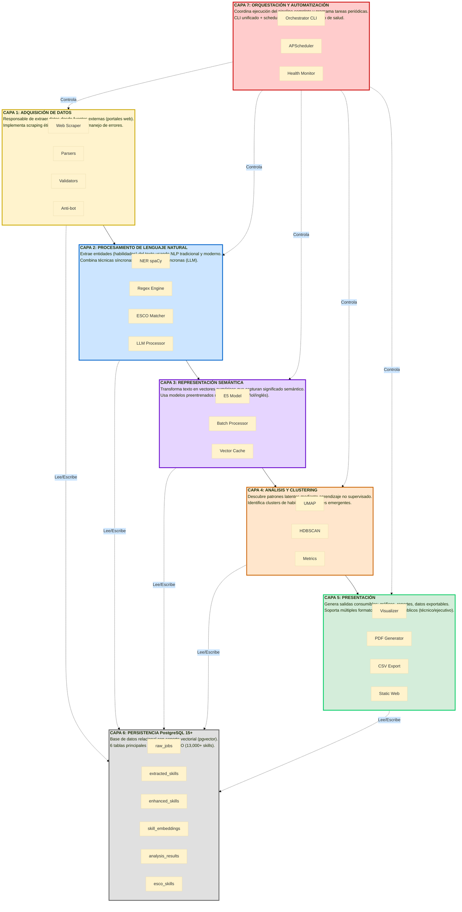

# 🎨 Códigos Mermaid - Listos para Generar Imágenes

## 📋 Instrucciones de Uso

1. Ve a **https://mermaid.live/**
2. Copia el código de cada diagrama
3. Pégalo en el editor
4. Personaliza colores si deseas (opcional)
5. Exporta como **PNG** o **SVG** (alta resolución)
6. Guarda la imagen en `docs/latex/diagrams/`
7. Incluye en LaTeX con `\includegraphics`

---

## 1️⃣ ARQUITECTURA MODULAR COMPLETA (8 Módulos)

**Archivo de salida sugerido**: `arquitectura-completa.png`

```mermaid
%%{init: {'theme':'base', 'themeVariables': { 'primaryColor':'#cce5ff','primaryTextColor':'#000','primaryBorderColor':'#0066cc','lineColor':'#333','secondaryColor':'#d4edda','tertiaryColor':'#fff3cd'}}}%%

flowchart TD
    subgraph M1["<b>MÓDULO 1: WEB SCRAPER</b>"]
        direction TB
        M1_F["<b>Función:</b> Extracción automatizada de ofertas laborales<br/><b>Entrada:</b> Portales web (Computrabajo, Bumeran, ElEmpleo)<br/><b>Salida:</b> Ofertas estructuradas (JSON)"]
        M1_T["<b>Tecnologías:</b><br/>• Scrapy 2.11<br/>• Selenium<br/>• BeautifulSoup"]
        M1_DB["<b>Almacenamiento:</b><br/>• raw_jobs<br/>• 23,000+ registros"]
    end

    subgraph M2["<b>MÓDULO 2: SKILL EXTRACTOR</b>"]
        direction TB
        M2_F["<b>Función:</b> Extracción de habilidades explícitas<br/><b>Entrada:</b> Texto de ofertas<br/><b>Salida:</b> Lista de habilidades con confianza"]
        M2_T["<b>Tecnologías:</b><br/>• spaCy NER<br/>• Regex Patterns<br/>• ESCO Matcher"]
        M2_DB["<b>Almacenamiento:</b><br/>• extracted_skills<br/>• Múltiples por job"]
    end

    subgraph M3["<b>MÓDULO 3: LLM PROCESSOR</b>"]
        direction TB
        M3_F["<b>Función:</b> Enriquecimiento semántico e inferencia de implícitas<br/><b>Entrada:</b> Habilidades extraídas + contexto<br/><b>Salida:</b> Habilidades normalizadas + implícitas"]
        M3_T["<b>Tecnologías:</b><br/>• Mistral 7B<br/>• LLaMA 3 8B<br/>• Prompt Engineering"]
        M3_DB["<b>Almacenamiento:</b><br/>• enhanced_skills<br/>• + razonamiento"]
    end

    subgraph M4["<b>MÓDULO 4: EMBEDDING GENERATOR</b>"]
        direction TB
        M4_F["<b>Función:</b> Generación de representaciones vectoriales<br/><b>Entrada:</b> Habilidades normalizadas (texto)<br/><b>Salida:</b> Vectores de 768 dimensiones"]
        M4_T["<b>Tecnologías:</b><br/>• E5 Multilingual<br/>• HuggingFace<br/>• Batch Processing"]
        M4_DB["<b>Almacenamiento:</b><br/>• skill_embeddings<br/>• pgvector (768D)"]
    end

    subgraph M5["<b>MÓDULO 5: DIMENSION REDUCER</b>"]
        direction TB
        M5_F["<b>Función:</b> Reducción de dimensionalidad para clustering<br/><b>Entrada:</b> Vectores de 768D<br/><b>Salida:</b> Vectores de 2D/3D para visualización"]
        M5_T["<b>Tecnologías:</b><br/>• UMAP<br/>• n_neighbors=15<br/>• metric=cosine"]
        M5_DB["<b>Almacenamiento:</b><br/>• analysis_results<br/>• + parámetros"]
    end

    subgraph M6["<b>MÓDULO 6: CLUSTERING</b>"]
        direction TB
        M6_F["<b>Función:</b> Agrupamiento no supervisado de habilidades<br/><b>Entrada:</b> Vectores reducidos (2D/3D)<br/><b>Salida:</b> Clusters de habilidades + etiquetas"]
        M6_T["<b>Tecnologías:</b><br/>• HDBSCAN<br/>• min_size=5<br/>• metric=euclidean"]
        M6_DB["<b>Almacenamiento:</b><br/>• analysis_results<br/>• + métricas"]
    end

    subgraph M7["<b>MÓDULO 7: VISUALIZATION</b>"]
        direction TB
        M7_F["<b>Función:</b> Generación de gráficos y visualizaciones<br/><b>Entrada:</b> Clusters + estadísticas<br/><b>Salida:</b> Imágenes PNG, páginas HTML estáticas"]
        M7_T["<b>Tecnologías:</b><br/>• Matplotlib<br/>• Seaborn<br/>• Plotly (static)"]
        M7_DB["<b>Almacenamiento:</b><br/>• outputs/PNG<br/>• outputs/HTML"]
    end

    subgraph M8["<b>MÓDULO 8: REPORT GENERATOR</b>"]
        direction TB
        M8_F["<b>Función:</b> Generación de reportes finales<br/><b>Entrada:</b> Visualizaciones + datos tabulares<br/><b>Salida:</b> Documentos PDF, archivos CSV, JSON"]
        M8_T["<b>Tecnologías:</b><br/>• ReportLab<br/>• Pandas<br/>• JSON/CSV"]
        M8_DB["<b>Almacenamiento:</b><br/>• outputs/PDF<br/>• outputs/CSV"]
    end

    M1 --> M2
    M2 --> M3
    M3 --> M4
    M4 --> M5
    M5 --> M6
    M6 --> M7
    M7 --> M8

    style M1 fill:#cce5ff,stroke:#0066cc,stroke-width:3px
    style M2 fill:#cce5ff,stroke:#0066cc,stroke-width:3px
    style M3 fill:#e6d5ff,stroke:#6600cc,stroke-width:3px
    style M4 fill:#e6d5ff,stroke:#6600cc,stroke-width:3px
    style M5 fill:#ffe6cc,stroke:#cc6600,stroke-width:3px
    style M6 fill:#ffe6cc,stroke:#cc6600,stroke-width:3px
    style M7 fill:#ffcccc,stroke:#cc0000,stroke-width:3px
    style M8 fill:#ffcccc,stroke:#cc0000,stroke-width:3px
```



**Colores**:
- 🟦 Azul: Módulos 1-2 (Adquisición y extracción)
- 🟪 Morado: Módulos 3-4 (Enriquecimiento semántico)
- 🟧 Naranja: Módulos 5-6 (Análisis no supervisado)
- 🟥 Rojo: Módulos 7-8 (Visualización y reportes)

---

## 2️⃣ ARQUITECTURA POR CAPAS (7 Capas)

**Archivo de salida sugerido**: `arquitectura-capas.png`



**Leyenda**:
- **Flechas sólidas** (→): Flujo de procesamiento vertical
- **Flechas punteadas** (⇢): Lectura/escritura a base de datos
- **Flechas punteadas** (⇢): Control desde orquestación

---

## 3️⃣ FLUJO DE TRANSFORMACIÓN DE DATOS

**Archivo de salida sugerido**: `flujo-transformacion.png`

```mermaid
%%{init: {'theme':'base', 'themeVariables': { 'primaryColor':'#d4edda','primaryTextColor':'#000','primaryBorderColor':'#00cc66','lineColor':'#333','secondaryColor':'#cce5ff','tertiaryColor':'#ffe6cc'}}}%%

flowchart LR
    subgraph FASE1["<b>ETAPAS 1-2</b><br/>Adquisición y extracción"]
        D1["<b>HTML</b><br/>Portales web<br/>Computrabajo<br/>Bumeran<br/>ElEmpleo"]
        P1[/"<b>SCRAPE</b><br/>+<br/><b>PARSE</b>"/]
        D2["<b>JSON</b><br/>Ofertas<br/>estructuradas<br/>23K+ jobs<br/>raw_jobs"]
        P2[/"<b>NER</b><br/>+<br/><b>REGEX</b>"/]
        D3["<b>Entities</b><br/>Habilidades<br/>explícitas<br/>+ ESCO URI<br/>extracted"]
    end

    subgraph FASE2["<b>ETAPAS 3-4</b><br/>Enriquecimiento semántico"]
        P3[/"<b>LLM</b><br/><b>ENHANCE</b>"/]
        D4["<b>Normalized</b><br/>Habilidades<br/>+ implícitas<br/>+ confianza<br/>enhanced"]
        P4[/"<b>E5</b><br/><b>EMBED</b>"/]
        D5["<b>Vectors</b><br/>768D<br/>embeddings<br/>pgvector<br/>cosine sim"]
    end

    subgraph FASE3["<b>ETAPAS 5-6</b><br/>Análisis no supervisado"]
        P5[/"<b>UMAP</b><br/><b>REDUCE</b>"/]
        D6["<b>2D/3D</b><br/>Vectores<br/>reducidos<br/>visualizable<br/>analysis"]
        P6[/"<b>HDBSCAN</b><br/><b>CLUSTER</b>"/]
        D7["<b>Clusters</b><br/>Grupos de<br/>habilidades<br/>+ etiquetas<br/>+ metrics"]
    end

    subgraph FASE4["<b>ETAPAS 7-8</b><br/>Visualización y reportes"]
        P7[/"<b>VISUALIZE</b><br/>+<br/><b>REPORT</b>"/]
        D8["<b>Outputs</b><br/>PDF / PNG<br/>CSV / JSON<br/>insights<br/>reportes"]
    end

    D1 --> P1 --> D2 --> P2 --> D3
    D3 --> P3 --> D4 --> P4 --> D5
    D5 --> P5 --> D6 --> P6 --> D7
    D7 --> P7 --> D8

    style FASE1 fill:#cce5ff,stroke:#0066cc,stroke-width:2px
    style FASE2 fill:#e6d5ff,stroke:#6600cc,stroke-width:2px
    style FASE3 fill:#ffe6cc,stroke:#cc6600,stroke-width:2px
    style FASE4 fill:#ffcccc,stroke:#cc0000,stroke-width:2px

    style D1 fill:#fff3cd,stroke:#ccaa00,stroke-width:2px
    style D2 fill:#d4edda,stroke:#00cc66,stroke-width:2px
    style D3 fill:#d4edda,stroke:#00cc66,stroke-width:2px
    style D4 fill:#d4edda,stroke:#00cc66,stroke-width:2px
    style D5 fill:#ffe6cc,stroke:#cc6600,stroke-width:2px
    style D6 fill:#ffe6cc,stroke:#cc6600,stroke-width:2px
    style D7 fill:#ffcccc,stroke:#cc0000,stroke-width:2px
    style D8 fill:#ffcccc,stroke:#cc0000,stroke-width:2px

    style P1 fill:#cce5ff,stroke:#0066cc,stroke-width:2px
    style P2 fill:#cce5ff,stroke:#0066cc,stroke-width:2px
    style P3 fill:#e6d5ff,stroke:#6600cc,stroke-width:2px
    style P4 fill:#e6d5ff,stroke:#6600cc,stroke-width:2px
    style P5 fill:#ffe6cc,stroke:#cc6600,stroke-width:2px
    style P6 fill:#ffe6cc,stroke:#cc6600,stroke-width:2px
    style P7 fill:#ffcccc,stroke:#cc0000,stroke-width:2px
```



**Transformación**: HTML → JSON → Entities → Normalized → Vectors 768D → 2D/3D → Clusters → Reports

---

## 📸 Configuración de Exportación Recomendada

### En mermaid.live:

1. **Formato**: PNG (para LaTeX) o SVG (si quieres vectorial)
2. **Escala**: 2x o 3x (alta resolución)
3. **Ancho**: Dejar en auto
4. **Fondo**: Blanco (marcar "transparent background" si prefieres)

### Tamaños sugeridos al exportar:

- **Diagrama 1** (Arquitectura Completa): 2000-2500px de ancho
- **Diagrama 2** (Capas): 1800-2000px de ancho
- **Diagrama 3** (Transformación): 2500-3000px de ancho (es horizontal)

---

## 📝 Cómo Incluir en LaTeX

Una vez que tengas las imágenes guardadas en `docs/latex/diagrams/`:

### Reemplazar los archivos .tex actuales:

```latex
% EN VEZ DE:
\input{diagrams/arquitectura-completa}

% USA:
\begin{figure}[H]
\centering
\includegraphics[width=0.95\textwidth]{diagrams/arquitectura-completa.png}
\caption{Arquitectura Modular Completa del Observatorio - Pipeline de 8 Etapas}
\label{fig:arquitectura-completa}
\end{figure}
```

### Para los 3 diagramas:

```latex
% Diagrama 1: Arquitectura Completa
\begin{figure}[p]
\centering
\includegraphics[width=0.95\textwidth]{diagrams/arquitectura-completa.png}
\caption{Arquitectura Modular Completa del Observatorio - Pipeline de 8 Etapas}
\label{fig:arquitectura-completa}
\end{figure}

% Diagrama 2: Capas
\begin{figure}[H]
\centering
\includegraphics[width=0.95\textwidth]{diagrams/arquitectura-capas.png}
\caption{Arquitectura en Capas del Sistema - Vista de Separación de Responsabilidades}
\label{fig:arquitectura-capas}
\end{figure}

% Diagrama 3: Transformación
\begin{figure}[H]
\centering
\includegraphics[width=0.98\textwidth]{diagrams/flujo-transformacion.png}
\caption{Flujo de Transformación de Datos a través del Pipeline}
\label{fig:flujo-transformacion}
\end{figure}
```

---

## ⚙️ Personalización Opcional en Mermaid

### Cambiar tema completo:
En la primera línea de cada diagrama, puedes cambiar el tema:

```
%%{init: {'theme':'forest'}}%%        // Tema verde
%%{init: {'theme':'dark'}}%%          // Tema oscuro
%%{init: {'theme':'neutral'}}%%       // Tema neutro/gris
%%{init: {'theme':'base'}}%%          // Tema personalizable (actual)
```

### Ajustar colores específicos:
Edita las líneas `style` al final de cada diagrama:

```mermaid
style M1 fill:#TU_COLOR,stroke:#TU_BORDE,stroke-width:3px
```

Colores sugeridos:
- Azul claro: `#cce5ff` / `#0066cc`
- Morado: `#e6d5ff` / `#6600cc`
- Naranja: `#ffe6cc` / `#cc6600`
- Verde: `#d4edda` / `#00cc66`
- Rojo: `#ffcccc` / `#cc0000`
- Amarillo: `#fff3cd` / `#ccaa00`

---

## ✅ Checklist de Generación

- [ ] Abrir https://mermaid.live/
- [ ] Copiar código del Diagrama 1
- [ ] Exportar como PNG (escala 2x-3x)
- [ ] Guardar como `arquitectura-completa.png`
- [ ] Repetir para Diagrama 2 → `arquitectura-capas.png`
- [ ] Repetir para Diagrama 3 → `flujo-transformacion.png`
- [ ] Copiar las 3 imágenes a `docs/latex/diagrams/`
- [ ] Actualizar Capítulo 5 con `\includegraphics`
- [ ] Recompilar LaTeX
- [ ] Verificar que se vean correctamente

---

## 🎯 Ventajas de Usar Mermaid + PNG

✅ **Sin superposiciones**: Mermaid calcula automáticamente el layout óptimo
✅ **Alta calidad**: Exporta en alta resolución
✅ **Fácil de modificar**: Solo editar código y re-exportar
✅ **Sin problemas de compilación**: Las imágenes PNG siempre funcionan en LaTeX
✅ **Profesional**: Los diagramas Mermaid se ven muy bien
✅ **Portátil**: Puedes usar las mismas imágenes en presentaciones, artículos, etc.

---

**¡Listo!** Con estos 3 códigos Mermaid tendrás diagramas perfectos sin superposiciones.
