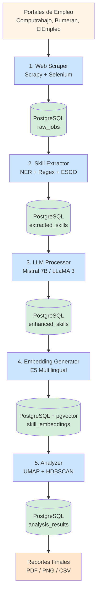
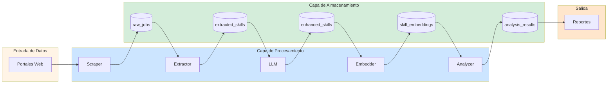
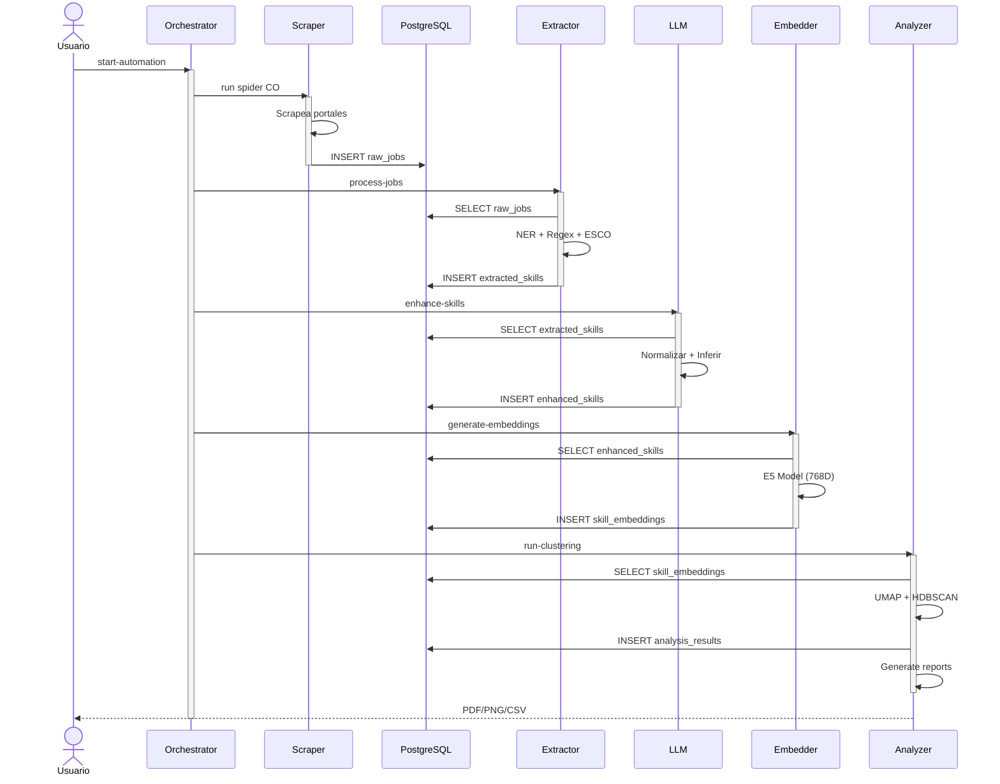
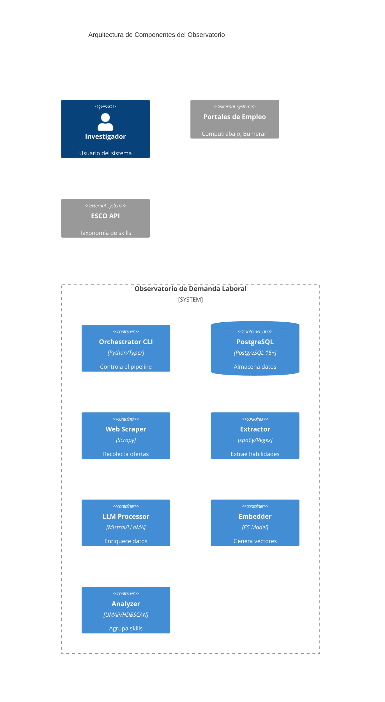
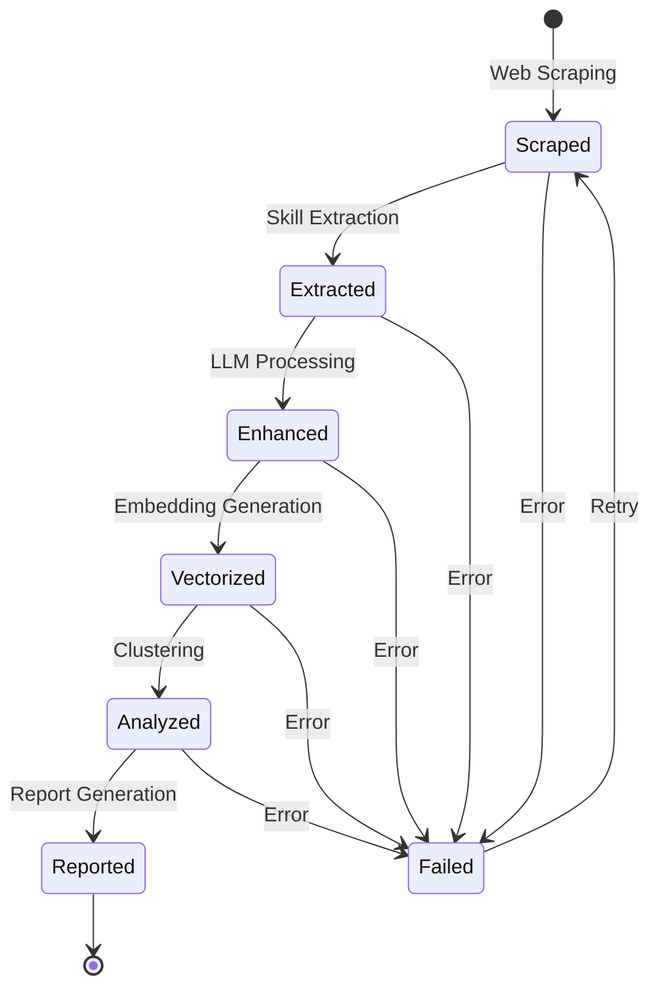
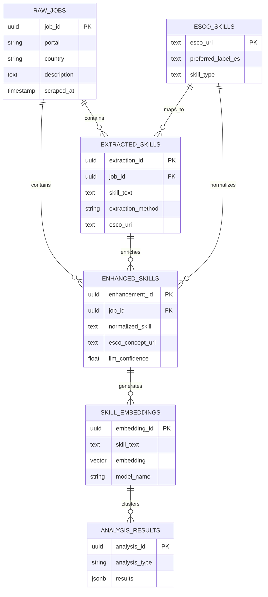

# Diagramas Mermaid para el Observatorio de Demanda Laboral

Estos diagramas pueden ser generados en: https://mermaid.live/

## 1. Arquitectura del Pipeline (Vertical)



## 2. Arquitectura con Capas (Horizontal)



## 3. Flujo de Datos Detallado



## 4. Arquitectura de Módulos (Componentes)



## 5. Diagrama de Secuencia (Flujo Completo)


## 6. Diagrama de Estados del Job



## 7. Diagrama ER Simplificado



## Instrucciones de Uso

### Para generar imágenes:

1. Ve a https://mermaid.live/
2. Copia y pega el código de cualquier diagrama
3. Ajusta colores y estilos si deseas
4. Exporta como PNG o SVG (alta resolución)
5. Incluye la imagen en LaTeX con:

```latex
\begin{figure}[H]
\centering
\includegraphics[width=0.8\textwidth]{diagrams/pipeline-mermaid.png}
\caption{Arquitectura del Pipeline}
\label{fig:pipeline-mermaid}
\end{figure}
```

### Recomendaciones:

- **Diagrama 1** es el más completo y recomendado para la sección de arquitectura
- **Diagrama 3** es excelente para explicar el flujo detallado
- **Diagrama 5** es perfecto para mostrar la secuencia temporal
- **Diagrama 7** es ideal para documentar la base de datos

### Alternativas online:

- https://mermaid.live/ (oficial)
- https://mermaid.ink/ (API para generar URLs)
- VS Code con extensión "Mermaid Preview"
